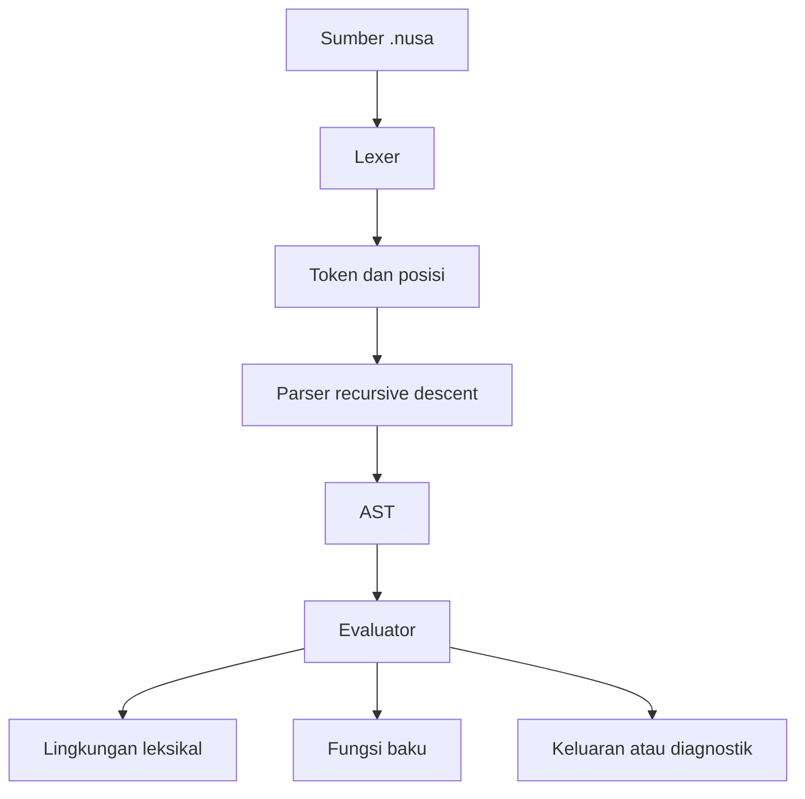

# Arsitektur NusaCode

## Gambaran umum

NusaCode memiliki dua jalur implementasi:

1. **Interpreter referensi Rust**, jalur utama yang dibangun Cargo dan menjalankan
   `.nusa` secara lintas platform.
2. **VM assembly x86-32**, jalur riset historis untuk mempelajari bytecode,
   representasi nilai, alokasi, dan API Windows tingkat rendah.

Kedua jalur tidak boleh dianggap setara fitur pada rilis 0.1.

## Pipeline Rust

### Lexer — `src/lexer.rs`

Lexer membaca Unicode berdasarkan `char`, mencatat baris dan kolom, menghapus
komentar `#`, memproses literal, dan memetakan alias Indonesia–Inggris ke token
semantik yang sama. Token baris baru dipertahankan karena Nusa memakai baris baru
atau `;` sebagai pemisah pernyataan.

### Parser — `src/parser.rs`

Parser recursive descent membentuk AST. Ekspresi menggunakan tingkat prioritas:
logika, kesamaan, perbandingan, penjumlahan, perkalian, pangkat, unary, panggilan,
dan indeks. Pangkat asosiatif kanan. Blok ditutup token eksplisit sehingga
indentasi tidak memengaruhi semantik.

### Runtime — `src/runtime.rs`

Evaluator menjalankan AST secara langsung. Lingkungan memakai scope berantai dan
reference counting agar fungsi dapat menangkap closure. Nilai runtime meliputi
bilangan, desimal, teks, logika, kosong, daftar, kamus, fungsi pengguna, dan
fungsi baku.

Perulangan dan percabangan membuat child scope. Assignment mencari binding dari
scope aktif menuju parent. Fungsi memiliki arity tetap dan batas kedalaman 1.000
panggilan untuk mencegah pertumbuhan stack tanpa batas.

### CLI — `src/main.rs`

CLI menyediakan:

- `nusa <file>` dan `nusa run <file>` untuk eksekusi;
- `nusa check <file>` untuk lex dan parse tanpa evaluasi;
- `nusa repl` untuk sesi interaktif dengan lingkungan persisten;
- `--help` dan `--version`.

## Model error

Tiga kategori error dipertahankan melalui `NusaError`: leksikal, sintaksis, dan
runtime. Setiap error membawa pesan Indonesia dan posisi sumber. Exit code CLI
adalah nol saat berhasil dan non-nol saat gagal.

## Batas arsitektur 0.1

- AST belum memiliki node modul, import, class, async, exception, atau pattern
  matching.
- Evaluator belum menghasilkan bytecode dan belum memiliki optimizer/JIT.
- Daftar dan kamus menggunakan cloning nilai; cocok untuk pembelajaran, belum
  optimal untuk beban data besar.
- Input belum dapat diinjeksi sebagai stream pada public API.
- Belum ada sandbox, capability model, atau batas waktu eksekusi.

## Jalur assembly

Modul `.asm` mendefinisikan VM stack, opcode, nilai 8-byte, arena memori, fungsi
baku, operasi teks/kontainer, dan harness uji. `build.ps1` hanya merakit subset
lama yang menjalankan `src/bytecode.asm`. Jalur tersebut dipertahankan tanpa
menjadi ketergantungan interpreter Rust.

## Arah evolusi

Tahap berikutnya adalah memisahkan frontend, semantic analysis, dan backend agar
AST dapat diturunkan ke bytecode portabel. Sistem modul dan package manager harus
didesain sebelum standard library aplikasi. Semua optimasi wajib mempertahankan
suite konformansi bahasa.
